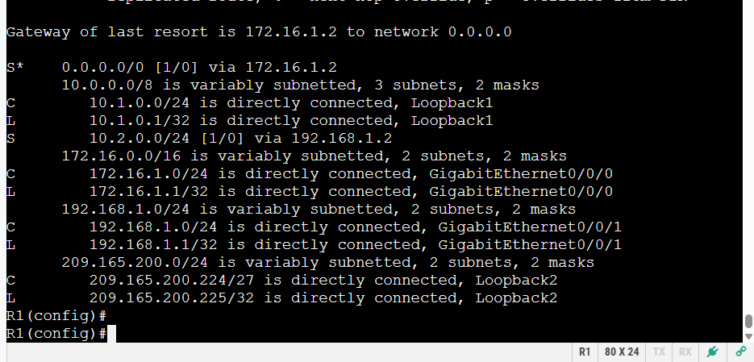
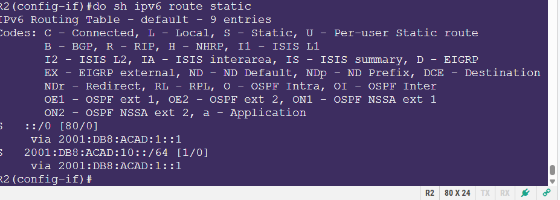
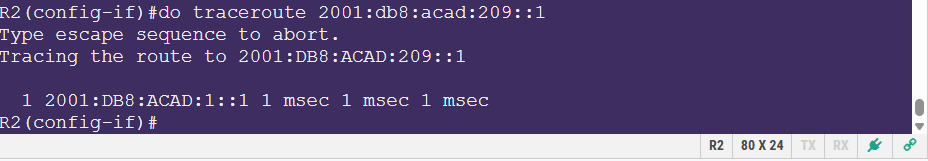
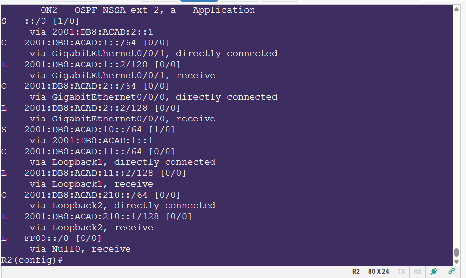
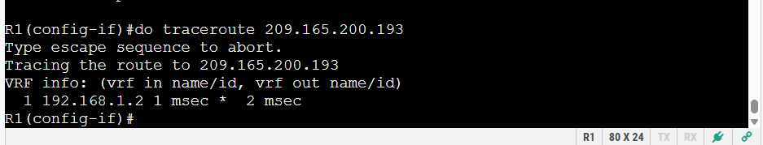
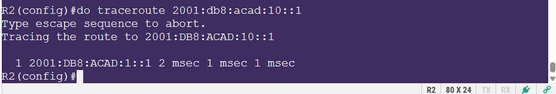

# 🛰️ Static and Default Routing Lab – IPv4 & IPv6

**Author:** Siraj Abdul-Shahid  
**Lab Date:** 5/7/2025  
**Environment:** Cisco NetLab – Real Equipment

---

## 🔧 Lab Overview

This lab focused on the configuration and validation of both IPv4 and IPv6 static and default routes on Cisco routers using real equipment. It also included a failover demonstration via floating static routes using administrative distance.

The lab topology involved two routers (R1 and R2), connected through a switch, with loopback interfaces simulating LAN networks.

---

## 🧱 Network Topology Summary

- **R1 and R2** each have:
  - Two GigabitEthernet interfaces:
    - `G0/0/0` (internal network – 172.16.1.0/24)
    - `G0/0/1` (router-to-router link – 192.168.1.0/24)
  - Two loopback interfaces:
    - Loopback1: private address range (10.x.x.x / 2001:db8:acad:10::/11::)
    - Loopback2: public-style address range (209.165.200.x / 2001:db8:acad:209::/210::)

- IPv4 and IPv6 were configured on all interfaces (dual-stack)

- Static and default routes were used to enable full connectivity between loopbacks

<details>
<summary>📸 View: Network Topology Diagram</summary>


</details>


---

## ⚙️ Interface & IP Configuration Summary

### 🔹 R1 Interface Config
```bash
interface GigabitEthernet0/0/0
 ip address 172.16.1.1 255.255.255.0
 ipv6 address 2001:db8:acad:2::1/64

interface GigabitEthernet0/0/1
 ip address 192.168.1.1 255.255.255.0
 ipv6 address 2001:db8:acad:1::1/64

interface Loopback1
 ip address 10.1.0.1 255.255.255.0
 ipv6 address 2001:db8:acad:10::1/64

interface Loopback2
 ip address 209.165.200.225 255.255.255.224
 ipv6 address 2001:db8:acad:209::1/64

```
### 🔹 R2 Interface Config
```bash
interface GigabitEthernet0/0/0
 ip address 172.16.1.2 255.255.255.0
 ipv6 address 2001:db8:acad:2::2/64

interface GigabitEthernet0/0/1
 ip address 192.168.1.2 255.255.255.0
 ipv6 address 2001:db8:acad:1::2/64

interface Loopback1
 ip address 10.2.0.1 255.255.255.0
 ipv6 address 2001:db8:acad:11::2/64

interface Loopback2
 ip address 209.165.200.193 255.255.255.224
 ipv6 address 2001:db8:acad:210::1/64

```
---
## 🚦 Static Route Configuration

### 🔸 On R1
```bash
ip route 10.2.0.0 255.255.255.0 192.168.1.2
ip route 209.165.200.192 255.255.255.224 192.168.1.2

ipv6 route 2001:db8:acad:11::/64 2001:db8:acad:1::2
ipv6 route 2001:db8:acad:210::/64 2001:db8:acad:1::2

```
<details>
<summary>📸 View: IPv4 Route Table – R1</summary>



</details>

### 🔸 On R2
```
ip route 10.1.0.0 255.255.255.0 192.168.1.1
ip route 209.165.200.224 255.255.255.224 192.168.1.1

ipv6 route 2001:db8:acad:10::/64 2001:db8:acad:1::1
ipv6 route 2001:db8:acad:209::/64 2001:db8:acad:1::1

```
---
## 🧩 Default & Floating Static Routes
### 🔸 Default Route on R1
```
ip route 0.0.0.0 0.0.0.0 192.168.1.2
```
### 🔸 Floating Default Route (R1, higher AD)
```
ip route 0.0.0.0 0.0.0.0 10.1.0.1 5
```
### 🔸 Default IPv6 Route
```
ipv6 route ::/0 2001:db8:acad:1::2
```
##### 💡 Floating routes are backup routes that only become active when the primary route fails. This was demonstrated by adjusting AD values and testing failover.
<details>
<summary>📸 View: Floating Static Route Table</summary>


</details>

<details>
<summary>📸 View: Floating Route Failover – Traceroute</summary>


</details>

---
## 🔍 Verification & Testing
<details>
<summary>📸 View: IPv6 Route Table – R2</summary>


</details>

<details>
<summary>📸 View: Traceroute to IPv4 Loopback</summary>


</details>

<details>
<summary>📸 View: Traceroute to IPv6 Loopback</summary>


</details>

- Used ping and traceroute to verify connectivity between loopback interfaces
- Verified active routes using:
  - show ip route
  - show ipv6 route
  - show running-config | section route
- Demonstrated that the floating route activates if the main path becomes unavailable
---
## ✅ Summary & Reflection
#### This lab provided valuable hands-on practice configuring and testing:
- Static and default routes for both IPv4 and IPv6
- Floating static routes with administrative distance
- Router interface IPs, loopbacks, and proper testing tools

#### Skills Reinforced:
- Manual route setup and verification
- IPv6 static route syntax and logic
- Network failover design with floating routes
- CLI tools for route and config analysis
---
## 📁 Files Included
| File                    | Description                        |
| ----------------------- | ---------------------------------- |
| `README.md`             | Summary and repo overview          |
| `report.md`             | Full write-up of the lab           |
| `/configs/`             | Device configuration files         |
| `/images/`              | Screenshots of route tables/tests  |
| `15.6.2 Lab - ... .odt` | Original lab submission (optional) |

